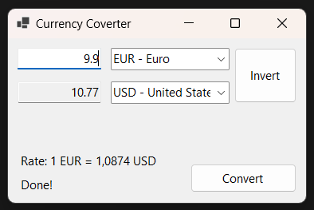

# CurrencyConverterGUI

## Overview
The Currency Converter GUI is a Graphical User Interface (GUI) application that builds upon the functionalities of the Currency Converter CLI. Leveraging the ExchangeRate-API for accurate and up-to-date currency conversion rates, this version is developed in C# and caters to users who prefer visual and interactive experiences.

## Features
- Intuitive Currency Conversion: Easily convert amounts between a wide range of currencies using a user-friendly graphical interface.
- Up-to-Date Exchange Rates: Like its CLI counterpart, it utilizes the ExchangeRate-API to access real-time currency conversion rates.
- Simple Currency Selection: Choose currencies for conversion through dropdown menus, enhancing usability over the CLI version.
 
## Screenshots

